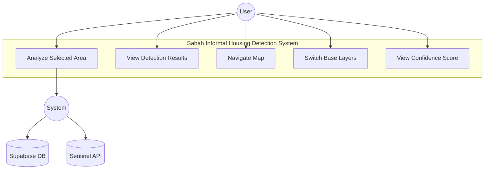
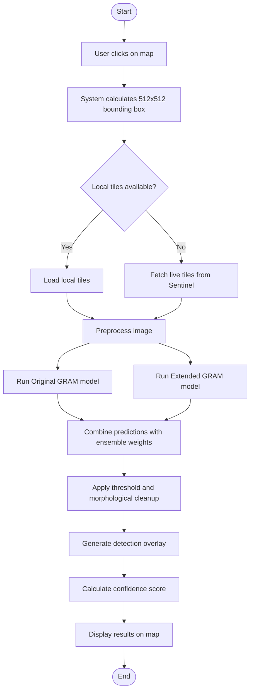
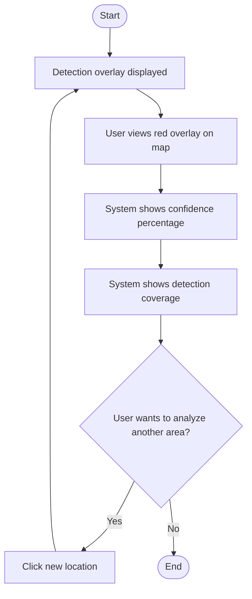
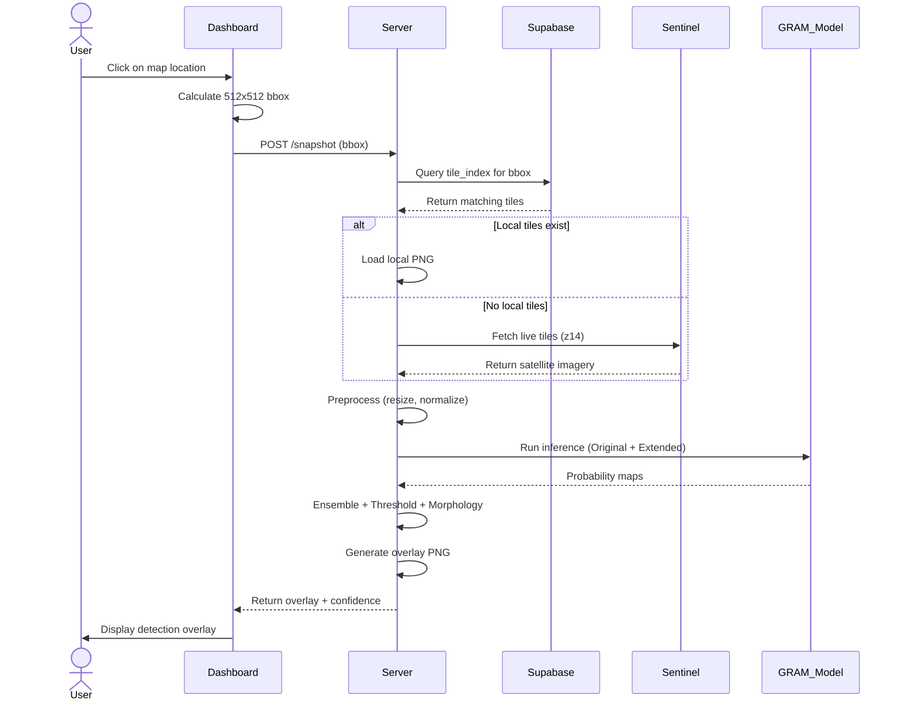
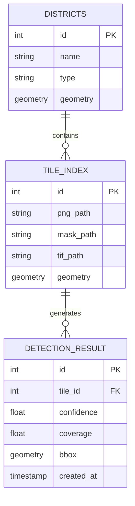
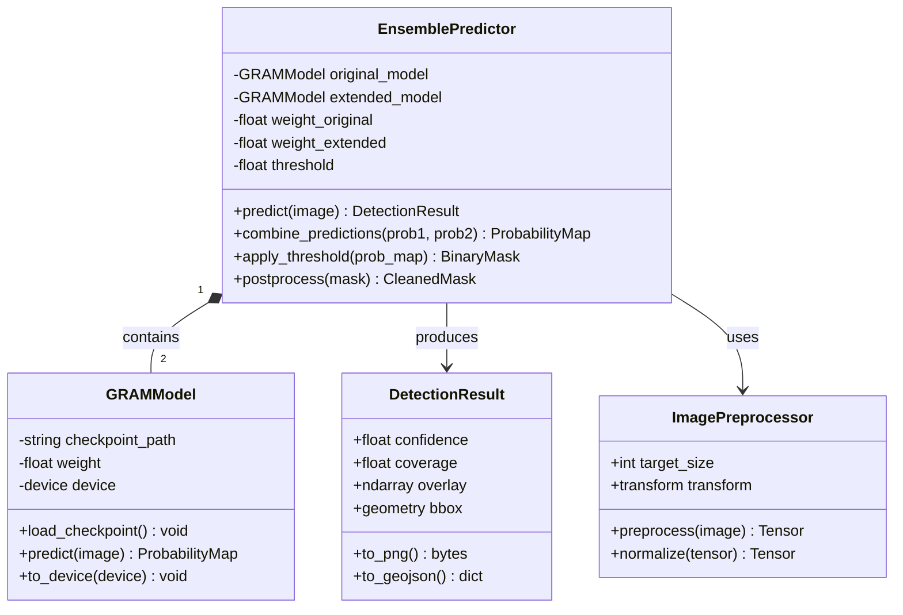

# Chapter 4: System Design Diagrams

## 4.1 Design Method
This system uses **Object-Oriented Design** with UML diagrams following the Agile/Hybrid methodology.

---

## 4.2 UML Diagrams

### 4.2.1 Use Case Diagram

### 4.2.2 Activity Diagram - Detect Informal Housing

### 4.2.3 Activity Diagram - View Results

### 4.2.4 Sequence Diagram - Detection Request

### 4.2.5 Use Case Specifications

#### Use Case 1: Analyze Selected Area

| Field | Description |
|-------|-------------|
| **Use Case ID** | UC-01 |
| **Use Case Name** | Analyze Selected Area |
| **Actor** | User |
| **Preconditions** | Dashboard is loaded, map is visible |
| **Main Flow** | 1. User selects marker tool 2. User clicks on map location 3. System calculates 512x512 analysis area 4. System fetches/loads satellite imagery 5. System runs GRAM ensemble model 6. System displays detection overlay |
| **Postconditions** | Detection overlay visible, confidence score displayed |
| **Alternative Flow** | If no local tiles, system fetches live tiles from Sentinel |

#### Use Case 2: View Detection Results

| Field | Description |
|-------|-------------|
| **Use Case ID** | UC-02 |
| **Use Case Name** | View Detection Results |
| **Actor** | User |
| **Preconditions** | Analysis has been performed |
| **Main Flow** | 1. User views red overlay on map 2. User reads confidence score in sidebar 3. User reads detection coverage percentage |
| **Postconditions** | User understands detection results |

#### Use Case 3: Navigate Map

| Field | Description |
|-------|-------------|
| **Use Case ID** | UC-03 |
| **Use Case Name** | Navigate Map |
| **Actor** | User |
| **Preconditions** | Dashboard is loaded |
| **Main Flow** | 1. User can pan map by dragging 2. User can zoom with scroll wheel 3. User can switch between Sentinel and Google layers |
| **Postconditions** | Map shows desired location |

---

## 4.3 Database Design (ERD)

Since the system uses **Supabase (PostgreSQL with PostGIS)**, the database schema is represented using an Entity Relationship Diagram (ERD):

### Table Descriptions

| Table | Description |
|-------|-------------|
| **TILE_INDEX** | Stores satellite tile metadata and spatial boundaries |
| **DISTRICTS** | Stores Sabah district boundaries and names |
| **DETECTION_RESULT** | Stores inference results with confidence scores |

---

## 4.4 AI Inference Design (Class Diagram)

The machine learning inference pipeline is represented using a Class Diagram:

### Class Descriptions

| Class | Responsibility |
|-------|----------------|
| **GRAMModel** | Loads and runs GRAM neural network inference |
| **EnsemblePredictor** | Combines two models with weighted averaging |
| **DetectionResult** | Holds detection output with confidence metrics |
| **ImagePreprocessor** | Resizes and normalizes input images |

---

## 4.5 Interface Design

### 4.5.1 Main Dashboard Interface

**Description**: The main interface shows an interactive Leaflet map with Sentinel-2 satellite imagery. The sidebar contains:
- Application title and description
- How to use instructions
- Analysis result panel
- Map legend

### 4.5.2 Detection Result View

**Description**: After clicking on the map, the system displays:
- Blue bounding box (512×512 analysis area)
- Red overlay (possible informal housing detections)
- Green/yellow areas (high confidence detections)
- Confidence score and coverage percentage in sidebar

### User Interaction

| User Type | Interface | Actions |
|-----------|-----------|---------|
| General User | Dashboard | Click map to analyze, view results, navigate |
| Researcher | Dashboard | Compare different areas, evaluate model performance |
| Urban Planner | Dashboard | Identify informal settlements for planning purposes |
